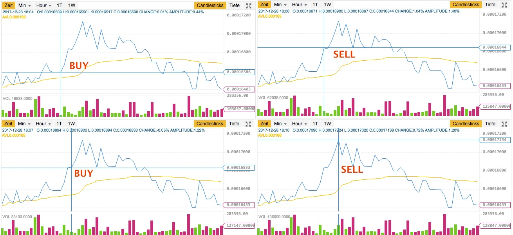
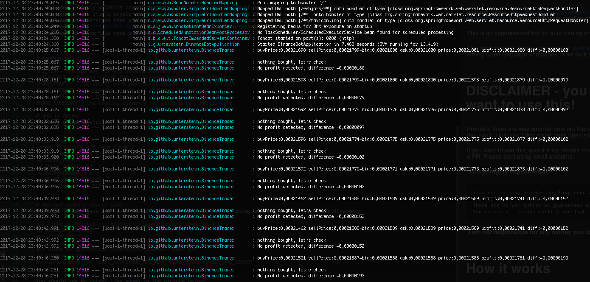

# Trading bot for binance

Inspired by the [Auto-buy the John McAfee coins he posts on Twitter at Bittrex](https://github.com/mattiasgeniar/McAfee-Shill-Bot) by 
[Mattias Geniar](https://twitter.com/mattiasgeniar) I decided to hack a small trading bot for binance.

This is an experimental bot for auto trading on the [binance.com](https://binance.com) platform.

This implementation was inspired by a [python trading bot](https://github.com/yasinkuyu/binance-trader), but I re-wrote
this in a strong typed language and added more fault tolerance.

I don't hold a lot of coins in any currency, so please don't try to hack me and enjoy this bot instead <3


# DISCLAIMER - you probably don't want to use this!
Probably there are way smarter bots out there, probably more than a hundred or thousand. I just can`t find smart ones open source ;-).

If you want to use this, give it a try, maybe modify the source, experiment and open a PR. Please start using small amounts!

**This is highly experimental!!**

**You could lose coins!**

**You could lose a lot of coins!**

**But you could gain some coins ¯\\\_(ツ)\_/¯**

**Please observe this bot while operating and give feedback, open a PR, contribute code <3**

**Don`t leave the bot alone while operating!**

```
I am not responsible for anything done with this bot. 
You use it at your own risk. 
There are no warranties or guarantees expressed or implied. 
You assume all responsibility and liability.
```

**I am not responsible for any money you lose!**

Please be aware, this bot follows a simple approach to gain profit and this code base don`t have a good test coverage.
Actually the code base has no coverage at all.
It is nice to play with and maybe a starting point for more smarter bots.


# How it works


**This picture above is just an example and was not subject of a real trade**

Basically this bot tries to capture bursts and buys in, if a configurable amount of gain over 3 seconds is detected.
The bot will check every 3 seconds to the order books of binance and compare `asks` and `bids` and will sell the just bought
amount if no more gain is detected. If something unexpected happens, the bot tries to sell everything.

**Please don`t use this bot if you are holding coins in the trading currency, because the bot will sell all coins after unexpected events!**

If you choose a highly fluctuating currency, you have a high chance to hit a maybe a dozen of those bursts per hour. Sometimes it works quite good, sometimes not :)


# Prerequisites

1. You need a highly volatile crypto currency, for example XVG or TRX (I use XVG) - **you should not hold coins of this currency**
2. You need a more stable crypto currency, for example LTC or ETH (I use ETH)
3. You need to understand that you are responsible for any trades this bot is going to execute!
4. You need to [create an API key](https://www.binance.com/userCenter/createApi.html) for binance.com
5. You need to clone this repo (you need maven and java installed) and run the code **OR** just use docker


# Configuration
```
API_KEY - the api key for you binance account - no default
API_SECRET - the api secret for you binance account - no default
TRADE_PROFIT - the profit in % your burst should have - 1.3 default
TRADE_AMOUNT - the trading amount per action - 150 default
BASE_CURRENCY - the base currency for all trades - ETH default
TRADE_CURRENCY - the trading currency for all trades - XVG default
```


# Run in docker
You have docker installed? Awesome! Just run the following command:

```
docker run -ti \
-e API_KEY='YOUR_KEY_FROM_BINANCE' \
-e API_SECRET='YOUR_SECRET_FROM_BINANCE' \
-e TRADE_PROFIT='1.3' \
-e TRADE_AMOUNT='50' \
-e BASE_CURRENCY='ETH' \
-e TRADE_CURRENCY='XVG' \
unterstein/binance-trader
```


# Run and compile source code
You need to have java and maven installed on your box. Run the following commands in your workspace directory:

```
# (Optional) Install maven
git clone git@github.com:binance-exchange/binance-java-api.git
cd binance-java-api
mvn clean install
cd ..
git clone git@github.com:unterstein/binance-trader.git
cd binance-trader
mvn spring-boot:run -DAPI_KEY=$YOUR_API_KEY -DAPI_SECRET=$YOUR_API_SECRET
```

# Package and run on server

```
# Run on desktop to package:
mvn clean package
scp target scp target/binancebot-0.0.1-SNAPSHOT.jar whateverhost:whateverpath

ssh whateverhost
# Run on server
java -jar -DAPI_KEY=$YOUR_API_KEY -DAPI_SECRET=$YOUR_API_SECRET -Dserver.port=$YOUR_HTTP_PORT binancebot-0.0.1-SNAPSHOT.jar

```


# Output
You should see an output like shown in the picture below:



# Feedback
Please give feedback and report your experience :)


# Donations

If this bot made you money in any way, I appreciate a donation:

- $BTC: 13sTnjH2CMBVzxiQ41PUenBnKFpjx9emHT
- $XRP: rEb8TK3gBgk5auZkwc6sHnwrGVJH8DuaLh (tag: 103358538)
- $LTC: Le7DSYFtvSHRhX5ndxj3jo1oZYEQCzeYkg
- $ETH: 0x3a3a32de226a34f8ab5c1eba66a81fb00b03d187
- $BCH: lol no
- ^ lol, love this joke :-)

This bot is offered free of charge with no guarantees whatsoever.
